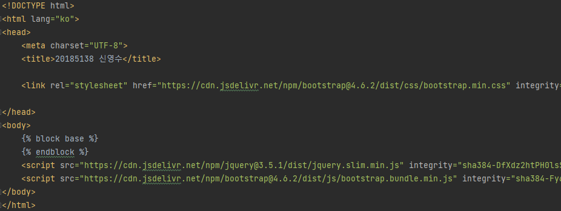
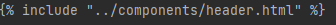

# 기본과제 5

## 오픈소스SW개발도구활용

## 20185138 신영수

### 사용한 도구

> node.js  
> express  
> nunjucks

반복되는 코드 사용을 줄이고자 `nunjucks` 탬플릿 엔진 라이브러리를 사용했습니다.

### 주소

- https://github.com/vl0011/HallymOpenSourceSW
- 158.247.207.31

### 실행

```bash
npm run test
```

### 프로젝트 구성

```
├─src               // 자바스크립트 코드 폴더 입니다.
└─template          // 템플릿 라이브러리 감시 폴더 입니다.
    ├─base          // 기본 레이아웃 정의 폴더
    ├─components    // 반복적으로 사용하는 컴포넌트 정의
    └─page          // 페이지 정의
```

#### src

`run.js` 파일에서 라이브러리 설정과 라우팅 경로를 설정합니다.

#### template/base

`<html>` `<style>` `<script>` `<meta>` 등의 태그와 부트스트랩 임포트등  
모든 페이지에서 공유되는 기본적인 레이아웃과 스타일을 정의한 폴더 입니다.

`/template/page` 에서 위 `html` 문서를 상속하여 사용하며  
`` 구문과 `` 구문 사이에 내용이 추가됩니다.

#### template/components

반복적으로 사용되는 컴포넌트를 정의했습니다. `header.html`은 네비게이션 바를 정의합니다.  
`/template/page` 에서 `include` 해서 사용합니다.  
  

#### template/page

사이트의 페이지를 정의했습니다.
