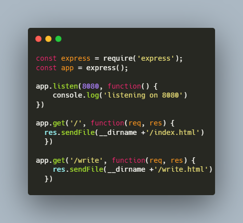
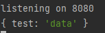

# 6주차 오픈소스SW개발도구 활용
## 20185138 신영수 

<!-- TOC -->
  * [소스코드](#)
  * [MongoDB Atlas 설정](#mongodb-atlas-)
    * [계정 생성](#-)
    * [무료 공유 클라우드 데이터베이스 생성](#----)
    * [IP 접속 허용](#ip--)
  * [문제 001](#-001)
    * [로그인 폼 작성](#--)
  * [문제 002](#-002)
    * [req.body undefined 문제 발생](#reqbody-undefined--)
      * [분석](#)
  * [문제 003](#-003)
  * [문제 004](#-004)
<!-- TOC -->

## 소스코드
[https://github.com/vl0011/HallymOpenSourceSW](https://github.com/vl0011/HallymOpenSourceSW)

## MongoDB Atlas 설정
### 계정 생성
  
MongoDB Atlas 홈페이지에서 계정을 생성 했습니다.

### 무료 공유 클라우드 데이터베이스 생성
  
ID/PW 인증 방식의 유저를 생성 했습니다.
  

### IP 접속 허용
  
현재 접속중인 IP를 입력 했습니다.  
한림대학교에서 작업한 화면이라 한림대학교 IP대역이 나타났습니다.

## 문제 001
### 로그인 폼 작성
  
`001` 소스코드로 다음과 같은 구조의 소스코드 입니다.

| 메소드 | 요청     | 응답         |
|-----|--------|------------|
| GET | /      | index.html |
| GET | /write | write.html |

`write.html` 은 로그인 폼임을 확인할 수 있습니다.  

  

| 태그     | 타입       | 내용           |
|--------|----------|--------------|
| Input  | Text     | EMail        |
| Input  | Text     | Password     |
| Input  | Checkbox | Check me out |
| Button | Submit   | Submit       |

## 문제 002
로그인폼에서 작성한 `form` 태그에서 `submit button` 을 클릭 하면  
`form`의 내용을 `post` 메소드 로 서버에 요청을 보냅니다.  
이를 처리하기위 `index.js` 에 다음 내용을 추가하여 유저의 로그인 폼의 내용을  
로그로 출력하도록 구성 했습니다.  

  

`write.html` 에서 `/add` 주소로 `form`의 내용을 전달하도록 `form`의  `action` 을 설정 했습니다.

  

### req.body undefined 문제 발생

  
```javascript
console.log(req.body);
```
위 명령어 에서 `req.body` 가 `undefined` 로 출력되는 문제가 발생 했습니다.  

#### 분석
```diff
app.post('/add', function(req, res){
+   console.log(req.get('Content-Type'))
    console.log(req.body);
    res.send('complete....')
  });
```
  
  
우선 요청 헤더의 `Content-Type`을 확인하여 `application/x-www-form-urlencoded`임을 확인 했습니다.  
또한, Chrome Network 분석으로 요청 헤더의 `Content-Type`을 확인하여 `application/x-www-form-urlencoded`임을 확인 했습니다.

```javascript
const express = require('express');
const app = express();

app.listen(8080, function() {
    console.log('listening on 8080')
})

+ app.use(express.urlencoded({ extended: true }));  // x-www-form-urlencoded post body 처리 미들웨어

app.get('/', function(req, res) { 
  res.sendFile(__dirname +'/index.html')
  })

app.get('/write', function(req, res) { 
    res.sendFile(__dirname +'/write.html')
  })

app.post('/add', function(req, res){
    console.log(req.body)
    res.send('complete....')
  });
```

`x-www-form-urlencoded` 파싱 미들웨어를 추가 한 후  
`/add` 엔드포인트에 `write.html` 과 Postman 을 사용하여  
로그를 확인해 보았습니다.

  
  

우선 Postman에서의 테스트 환경에서 결과는 정상적으로 출력 되었습니다.

  

그러나 `write.html`에서는 빈 오브젝트가 리턴 되었습니다.  

클라이언트 웹 페이지에서 문제가 있다고 판단되어 Postman으로 간단한 웹서버를 열어  
클라이언트가 보내는 요청의 body를 분석해 보았습니다.
  
요청 바디의 내용이 없음을 확인할 수 있었습니다.

`input`태그에 name을 설정하지 않아서 생긴오류로 name을 설정하여 문제를 해결 했습니다.


## 문제 003
`Express` 실행 전 `MongoDB`가 실행되도록 설정 했습니다.
  
  
`MongoDB Drivers` 를 클릭하여 `node`에서 `MongoDB`를 접속하기 위한 주소를 얻었습니다.

`MongoDB` URL을 설정하고, 문제 002에서 발견한 문제를 수정 했습니다.

  
  
이상없이 실행되었습니다.
4
## 문제 004

`MongoDB` 커넥션을 생성하여 다른 메소드가 사용할 수 있도록 전역변수 `db`에 커넥션을 저장 했습니다.

  
POST 요청 시 데이터베이스에 값을 추가하도록 수정 했습니다.

웹에서 로그인 요청을 하였고 로그의 출력과 `MongoDB`에 추가된 값 입니다.


